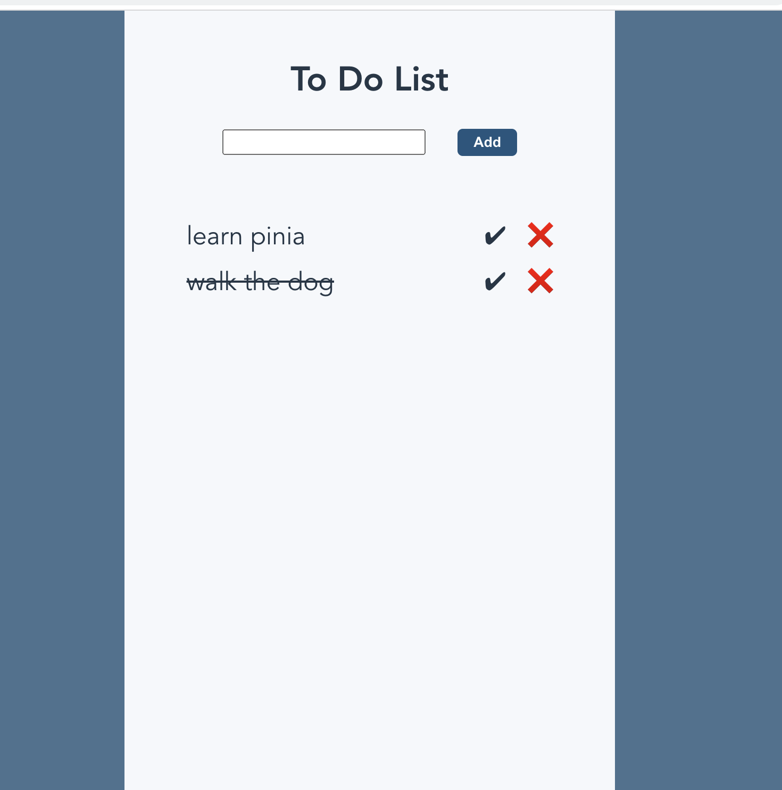

# todo-pinia

This is a tutorial that presents how to use the new (and official) state management library for Vue 3 - [Pinia](https://pinia.vuejs.org/) - to build a to-do list app. It also has a bonus section on using Typescript with Pinia.

Checkout the [Pinia docs](https://pinia.vuejs.org/)

